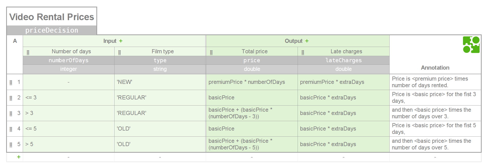

Video Rental Store
==================

Exercise implemented in Java 8 as a JAX-RS API and in-memory storage.

* The entities involved are: customer, film, order and rental.

* The video rental process is simplified from a real flow. Notably,
an order can only be billed once all their rentals are returned.

Quick start
-----------

To start the Video Rental Store, go to to the folder `rest-api` and execute:

`mvn jetty::run`

To check if the server is up, navigate from your browser to the URLs:

[http://localhost:8080/api/films](http://localhost:8080/api/films)
[http://localhost:8080/api/customers](http://localhost:8080/api/customers)
  
REST API
--------

* The exposed resources are: `customers`, `films`, `orders` and `rentals`.
    * Each resource can list its contents by a `GET` request.
    * When appending a valid resource id, `GET` requests return the resource data.
    * For `orders` and `rentals`, `POST` method creates new resources and `PUT`
      method bills the order and returns a film respectively.

* Dates and money are serialized in JSON as their corresponding ISO strings.

* Error codes are simplified as `202 (OK)`, `400 (Bad request)` and `404 (Not found)`,
  and reported as an array of JSON objects containing a message. 
  For parameter validation, also the path and the value of the offending parameter.

Decision rules
--------------

Prices decision rules are implemented using Camunda DMN in a per-currency basis.
To change the rules, go to the [DMN Toolkit demo](http://demo.bpmn.io/dmn/new) and load the file 
corresponding to the currency you want to apply the rules for, following the pattern:
`/video-rental-store/domain/src/main/resources/price-rules_<currency code>.dmn`.

Where `<currency code>` is a ISO three-letter currency code (e.g. 'SEK'). 
You can then replace the existing XML to see the policy changes.

In the DMN editor rules are visualized something like:

Other considerations
--------------------

* Model entities are immutable for fields that do not change.

* Date & Time handling is done by the class `java.time.Clock`, allowing alternate times during testing.

* Logging is handled by the SLF4J simple logger. JUL is also redirected to SLF4J.

Deployment
----------

Building the `server` module generates a uber-jar that can be run as an executable JAR.
It contains the Video Rental Store application in an embedded Jetty server.

Testing
-------

The module `domain` contains JUnit tests to validate the video rental process and final prices.

The module `rest-api` contains JUnit tests to validate the REST rental process and its errors.

